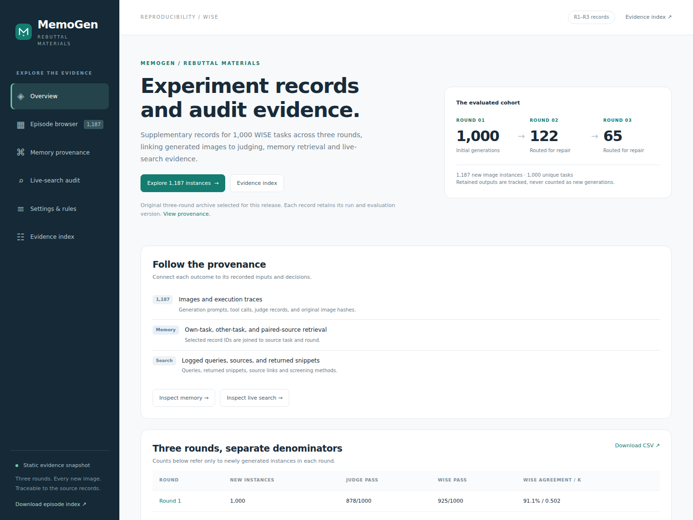

# MemoGen Supplementary Material

[View the audit website](https://chatonz.github.io/memogen-audit/)



A static GitHub Pages website maintaining **1,000 Round-1, 122 Round-2 and 65 Round-3 image instances**. The 1,187 records are newly generated instances; carried-forward outputs are not duplicated.

The author selected the original local experiment archive for this release. **Human annotations, individual scores and aggregate human-agreement statistics are excluded from the public website and all downloads.**

## Public content

- Search and filter by round, task, category, judge/WISE disagreement, retrieval provenance, and search-screening matches.
- Per-instance generated image, original image SHA256, generation prompt, rubric, judge response, official-protocol label, model-call metadata, tool inputs/outputs, selected image references, and source pointers.
- Own-task and other-task memory provenance; paired-source retrieval is reported in a separate analogical-transfer section with both recorded run versions.
- Judge prompts, parser and memory-code snapshots; run manifests; current-code defaults are distinguished from recorded historical settings.
- Logged live-search queries, snippets, URLs and automated screening. These records document open-web evaluation; benchmark-specific leakage is not established. A blocked-search or frozen-corpus comparison is outside this release.
- A rebuttal evidence index linking judge settings, memory rules, traces, evaluation records and search methods.

## Evaluation versions

The strict routing judge is `gpt-5.5 / evolution_wise_strict_v1`.

- **R1:** full September 19 WISE-protocol re-evaluation using Qwen3.5-35B-A3B. Judge agreement: 911/1000, 91.1%, Cohen's κ=0.502. Matrix: both pass 857; both fail 54; judge-only pass 21; WISE-only pass 68.
- **R2 and R3:** archived July evaluations, matched to the actual newly generated images. Their results are reported separately from R1. The site does not synthesize a headline multi-round accuracy curve from these versions.

The archived strict judge prompt accepts a benchmark explanation. It is released with its exact provenance and is **not relabelled as the final isolated-server judge configuration**. The author separately reports a fully isolated final experiment; those artifacts are outside this import.

## Run locally

```bash
python -m http.server 8767 --directory site
```

Open `http://localhost:8767`. A current browser is required: episode JSON files use standard gzip compression and the browser's native `DecompressionStream`. No third-party scripts, fonts, analytics or server backend are used.

## Rebuild from the original archive

In the publication repository, the exporter is in `maintenance/build_from_memogen.py`:

```bash
python -m pip install Pillow
python maintenance/build_from_memogen.py \
  --project-root /path/to/MemoGen \
  --output site
python maintenance/validate.py site
```

In the original MemoGen working copy, run `python tools/reviewer_audit/build.py` and `python tools/reviewer_audit/validate.py` instead.

The importer is deliberately bound to:

```text
eval_outputs/v4_benchmark_pool/v4_wise_gpt55_wise_strict_v1_r1summary_20260717
```

It reads source SQLite databases in read-only mode and never runs a model or modifies experiment records. Importing a different experiment requires aligning that experiment's official-label and image provenance first; changing the folder argument alone is rejected.

## Maintain the evidence

1. Preserve each run's identity, model/profile, prompt hash and evaluator version.
2. Regenerate the public export from source records; do not hand-edit labels or provenance counts.
3. Run the validator. It checks cohort/routing identities, image availability, official alignment, checksums and exclusion of human scoring and credentials.
4. For manual live-search audit results, add source-backed adjudications with query/result identifiers, exact excerpts, decision and reviewer metadata. Keep ordinary knowledge matches separate from benchmark-specific exposure.
5. Publish blocked-search rerun results only when the image/label pairs, blocking rules and clean initial memory state are available. Describe the evaluation setting and evidence directly, without workflow or completion labels.

The existing reference images retain their recorded source attribution. Preview assets are derived WebP images; hashes identify the original generation and reference files. The public export omits embedded image bytes, credentials and local machine path prefixes. Compact execution traces contain recorded tool calls and model-call metadata, not a reconstructed reasoning transcript.

## Deploy on GitHub Pages

The publication repository includes `.github/workflows/pages.yml`. Push to `main`, then set **Settings → Pages → Source → GitHub Actions**. The workflow validates and uploads only `site/`, and deploys it using the official Pages actions.

All asset URLs are relative, so the site works at `https://OWNER.github.io/memogen-audit/` without a custom domain or build-time base URL.
