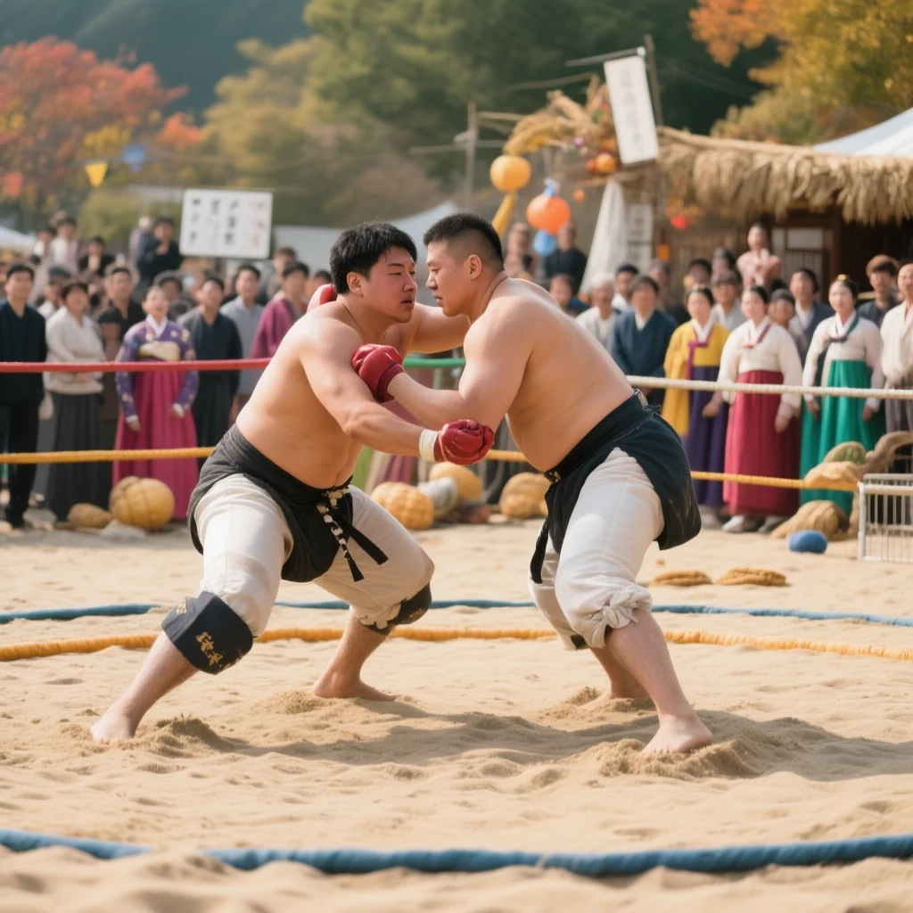
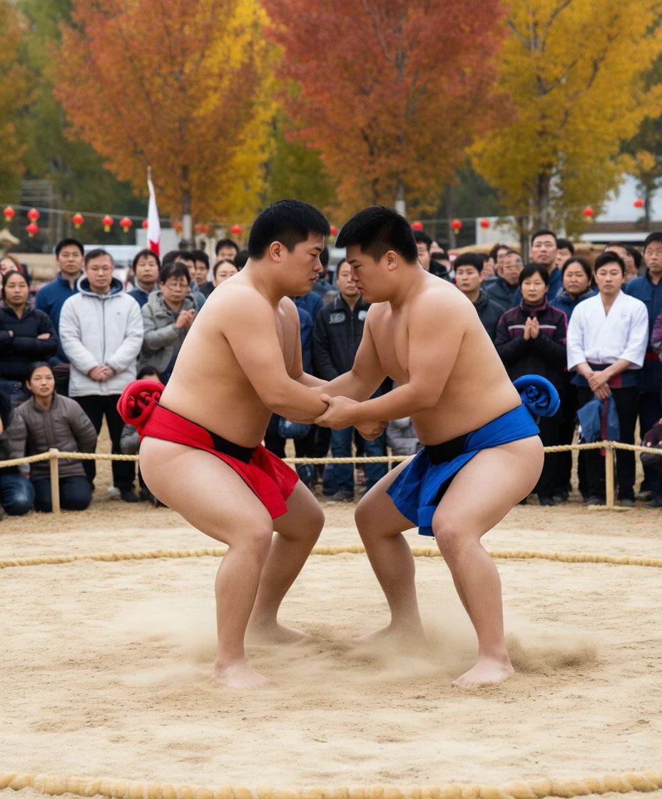

# Ssireum · WISE #2

[Results](../../README.md) · [Instance index](../README.md)

> The traditional Korean contest often held during Chuseok, where two competitors grapple in a sand ring

## Round 1



**Memory judge: Fail · WISE: Pass**

1 generation calls · 0 own-task / 0 other-task selected memories. Evaluation: WISE full R1 · 2026-09-19.

### Generation prompt

A realistic cultural festival scene of ssireum, traditional Korean wrestling during Chuseok: two adult Korean male competitors wearing satba cloth belts tied around waist and thigh grapple intensely in a circular sand ring, crouched low and gripping each other’s belts with both hands, bare feet digging into sand. They are the clear central focus. Around the ring, spectators watch respectfully, some wearing colorful hanbok, with subtle Korean autumn harvest festival decorations and warm daylight. Documentary realism, dynamic but anatomically natural posture, visible sand surface and ring boundary, festive outdoor arena atmosphere. Avoid all readable text, logos, signage, boxing ropes, gloves, mats, cages, judo uniforms, or sumo mawashi-only styling.

### Memory-judge decision

<details>
<summary>Structured judge response</summary>

```json
{
  "active_reasoning_types": [
    "world_knowledge",
    "cultural_knowledge"
  ],
  "atomic_criteria": [
    {
      "criterion": "The image should clearly depict ssireum, the traditional Korean wrestling contest.",
      "evidence": "The image shows two shirtless wrestlers in a sand area with Korean festival cues, but the red boxing gloves and roped ring make the sport look like a hybrid boxing/wrestling scene rather than clearly identifiable ssireum.",
      "severity": "critical",
      "status": "ambiguous_critical",
      "type": "core"
    },
    {
      "criterion": "Two competitors should be grappling in a sand ring.",
      "evidence": "Two competitors are shown physically engaged on sand inside a ring-like area.",
      "severity": "critical",
      "status": "satisfied",
      "type": "core"
    },
    {
      "criterion": "Ssireum-specific visual cues such as satba belts or waist/thigh gripping should be visible.",
      "evidence": "There are dark waist cloths that could suggest belts, but the competitors are wearing gloves and are not clearly gripping satba in the standard ssireum manner.",
      "severity": "critical",
      "status": "ambiguous_critical",
      "type": "core"
    },
    {
      "criterion": "The scene should evoke a Korean Chuseok or traditional festival setting.",
      "evidence": "The crowd includes people in hanbok-like clothing, autumn foliage, pumpkins, and festival decorations.",
      "severity": "major",
      "status": "satisfied",
      "type": "supporting"
    },
    {
      "criterion": "The image should not show boxing/MMA equipment that contradicts ssireum.",
      "evidence": "Both competitors wear red boxing gloves, which are not used in ssireum and interfere with the required traditional grappling identity.",
      "severity": "critical",
      "status": "satisfied",
      "type": "forbidden"
    },
    {
      "criterion": "The contest should not resemble sumo, boxing, or generic combat sport more than Korean ssireum.",
      "evidence": "The boxing gloves and roped arena introduce strong non-ssireum combat-sport cues.",
      "severity": "major",
      "status": "satisfied",
      "type": "forbidden"
    }
  ],
  "calibration_notes": {
    "ambiguity_level": "critical",
    "common_confuser_risk": "medium",
    "knowledge_error_risk": "medium",
    "wise_explanation_satisfied": false,
    "wise_target_answer_visible": false
  },
  "confidence": 0.76,
  "critical_failures": [
    "The exact WISE target, ssireum, is not visually unambiguous because the competitors wear boxing gloves and are not clearly using satba-style grips.",
    "Visible boxing/MMA-style elements contradict the traditional Korean ssireum requirement."
  ],
  "dimension_scores": {
    "core_requirement_satisfaction": 0.6,
    "reasoning_knowledge_correctness": 0.62,
    "task_fidelity": 0.72,
    "visual_reference_quality": 0.78
  },
  "enhanced_prompt_safety": {
    "issues": [],
    "status": "not_provided"
  },
  "final_judgment": "FAIL",
  "non_critical_issues": [
    "The Korean festival atmosphere and sand setting are appropriate, but they do not fully overcome the incorrect sport-specific details."
  ],
  "overall_score": 0.68,
  "pass": false,
  "regenerate": true,
  "rewrite_guidance": [
    "Depict a clear ssireum match: two Korean wrestlers barefoot and shirtless or in traditional ssireum attire, grappling in a circular sand pit.",
    "Remove boxing gloves and roped boxing-ring elements.",
    "Show satba belts tied around the waist and thigh, with each wrestler gripping the opponent’s satba.",
    "Keep Chuseok festival context with Korean spectators, hanbok, and autumn harvest decorations if desired."
  ],
  "task_summary": "The intended target is ssireum: a traditional Korean wrestling contest held during Chuseok, with two competitors grappling in a sand ring, typically using satba belts and no boxing-style gloves."
}
```

</details>


[Complete instance record](../../site/data/episodes/r1-2.json.gz) · [Round 1 index](../round-1.md)

## Round 2



**Memory judge: Pass · WISE: Pass**

2 generation calls · 4 own-task / 0 other-task selected memories. Evaluation: WISE historical R2 · 2026-07-19.

### Generation prompt

Regenerate as a single unified realistic documentary sports photograph of traditional Korean ssireum during Chuseok. Correct the previous issues: NO hand-clasping, NO wrist grabbing, NO background signs or readable characters. Center two adult Korean male ssireum wrestlers very close together in low crouches in an open circular sandpit. Each wrestler is shirtless, barefoot, wearing short plain competition trunks and a clearly constructed satba fabric belt: one red satba and one blue satba, each visibly looped around the wrestler’s waist AND one thigh/upper leg. Make the central action unmistakable ssireum belt-grappling: the left wrestler’s two bare hands are wrapped around the right wrestler’s blue satba at the waist/thigh loop, and the right wrestler’s two bare hands are wrapped around the left wrestler’s red satba at the waist/thigh loop. Hands must be down at belt and upper-thigh level, not clasped between chests. Show sand and dust kicked up around bare feet. Spectators watch respectfully outside a low rope or marked sand boundary, with autumn trees and subtle Korean Chuseok harvest-festival atmosphere, but no signs, no text, no logos, no watermarks. Avoid boxing ropes, ring posts, gloves, MMA cage, gym mats, judo uniforms, sumo-only mawashi styling, collage, split screen, or news graphics.

### Memory-judge decision

<details>
<summary>Structured judge response</summary>

```json
{
  "active_reasoning_types": [
    "world_knowledge",
    "cultural_knowledge"
  ],
  "atomic_criteria": [
    {
      "criterion": "Depicts the specific traditional Korean contest ssireum rather than a generic wrestling match.",
      "evidence": "Two bare-chested competitors are wrestling in a sandy ring with colored waist/thigh cloths resembling ssireum satba, in a public festival setting.",
      "severity": "critical",
      "status": "satisfied",
      "type": "core"
    },
    {
      "criterion": "Shows two competitors grappling with each other.",
      "evidence": "The two wrestlers face each other in a crouched stance and are locked in a hand-to-hand grapple.",
      "severity": "critical",
      "status": "satisfied",
      "type": "core"
    },
    {
      "criterion": "The match takes place in a sand ring.",
      "evidence": "The competitors stand barefoot on a clearly sandy circular ring bordered by rope.",
      "severity": "critical",
      "status": "satisfied",
      "type": "core"
    },
    {
      "criterion": "The scene suggests a Korean festival or Chuseok context.",
      "evidence": "A crowd surrounds the ring, with autumn foliage and festival-like decorations, fitting a Chuseok celebration setting.",
      "severity": "major",
      "status": "mostly_satisfied",
      "type": "supporting"
    },
    {
      "criterion": "Should not depict sumo, judo, MMA, or another non-Korean wrestling sport as the main answer.",
      "evidence": "Although the body type and loincloth-like cloth create some sumo resemblance, the sand ring and colored satba-like belts support ssireum rather than sumo.",
      "severity": "critical",
      "status": "not_applicable",
      "type": "forbidden"
    },
    {
      "criterion": "Ssireum satba-style belts or cloth grips should be visually present.",
      "evidence": "Red and blue waist/thigh cloths are visible, though the wrestlers are gripping hands rather than clearly gripping the satba.",
      "severity": "minor",
      "status": "mostly_satisfied",
      "type": "supporting"
    }
  ],
  "calibration_notes": {
    "ambiguity_level": "minor",
    "common_confuser_risk": "low",
    "knowledge_error_risk": "low",
    "wise_explanation_satisfied": true,
    "wise_target_answer_visible": true
  },
  "confidence": 0.86,
  "critical_failures": [],
  "dimension_scores": {
    "core_requirement_satisfaction": 0.88,
    "reasoning_knowledge_correctness": 0.86,
    "task_fidelity": 0.9,
    "visual_reference_quality": 0.88
  },
  "enhanced_prompt_safety": {
    "issues": [],
    "status": "not_provided"
  },
  "final_judgment": "PASS",
  "non_critical_issues": [
    "The wrestlers are not clearly gripping each other's satba, which is a distinctive ssireum detail.",
    "The loincloth-like cloth and large body types introduce a mild sumo-confuser risk, but the sand ring and Korean festival context keep the target recognizable."
  ],
  "overall_score": 0.88,
  "pass": true,
  "regenerate": false,
  "rewrite_guidance": [],
  "task_summary": "The intended target is ssireum, a traditional Korean wrestling contest held during Chuseok, shown as two competitors grappling in a sand ring."
}
```

</details>


### Selected memories

| Source | Polarity | Relation | Repair hint |
| --- | --- | --- | --- |
| [R1 / #2](../../site/images/view/r1-2.webp) | negative | Both competitors are shown wearing red padded gloves, which conflicts with ssireum belt-grappling and the explicit prohibition on gloves. | Depict bare hands gripping the satba belts with no padded gloves or combat-sport handwear. |
| [R1 / #2](../../site/images/view/r1-2.webp) | negative | The match area is enclosed by red and yellow boxing-style ropes instead of an unobstructed circular sand ring boundary appropriate for ssireum. | Remove all boxing-style ropes and use a low circular sand boundary or marked sand perimeter around the competitors. |
| [R1 / #2](../../site/images/view/r1-2.webp) | negative | The match should be visually identifiable as ssireum rather than boxing, MMA, or another combat sport. | Emphasize bare-handed satba belt grappling in an open circular sand pit with no boxing equipment. |
| [R1 / #2](../../site/images/view/r1-2.webp) | negative | The competitors are not clearly gripping each other's satba belts with both hands; their hands appear to be on upper bodies or gloved contact points instead of belt-grappling at the waist/thigh. | Place both wrestlers in low crouches with bare hands visibly grasping the opponent's satba at the waist and thigh/hip area. |

[Complete instance record](../../site/data/episodes/r2-2.json.gz) · [Round 2 index](../round-2.md)
